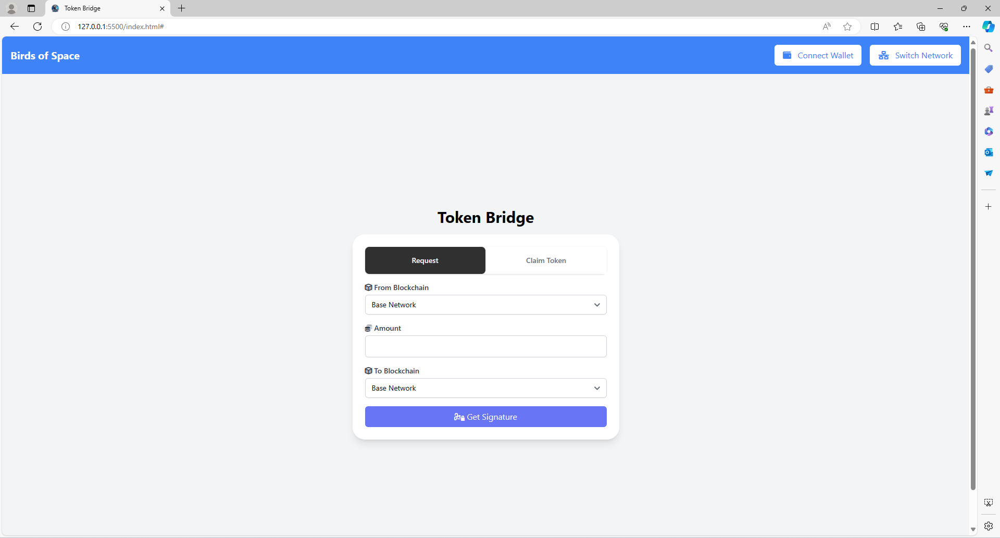
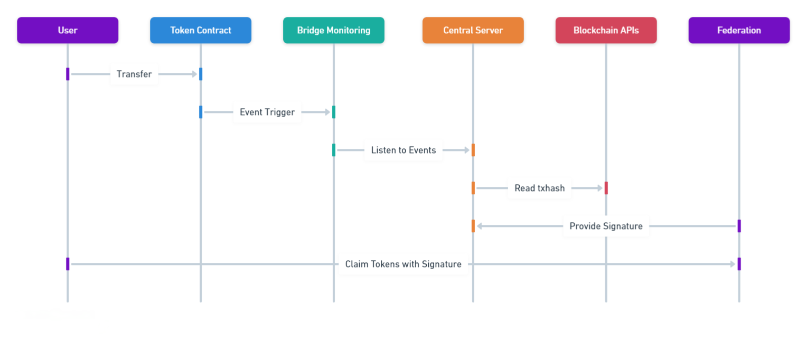
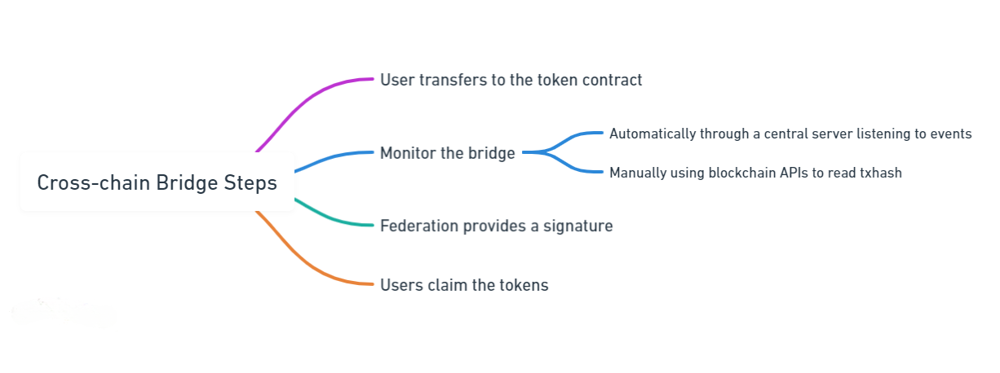

# Cross-Chain Bridge Deployment Guide

This guide provides steps for deploying the Cross-Chain Bridge application, including setting up the node, dashboard, federation server, and bridge front-end.

## Prerequisites

- Node.js and Yarn installed
- Truffle framework installed
- Solidity smart contracts for the token bridge
- Hardhat installed
- MetaMask extension for your browser
- Knowledge of deploying and managing blockchain applications

## Installation

Clone the repository and navigate to the project directory:

```bash
git clone https://github.com/your-username/cross-chain-bridge.git
cd cross-chain-bridge
```

Install dependencies:

```bash
yarn install
```

## Running the Node

To run the node, use the following command:

```bash
yarn run node
```

## Dashboard Deployment

To deploy the dashboard, use the following command:

```bash
yarn truffle-dashboard
```

## Starting Deployment

To start the deployment process, use the following command:

```bash
yarn deploy
```

## Running the Federation Server

To run the federation server, use the following command:

```bash
yarn fserver
```

## Running the Bridge Front-End

To run the bridge front-end, use the following command:

```bash
yarn frontend start
```

## Algorithm


The algorithm for the cross-chain bridge is as follows:

1. Users transfer to the token contract.
2. Bridge monitoring can be done automatically through a central server listening to events or manually using blockchain APIs to read txhash.
3. The Federation provides a signature to claim tokens if the bridge is valid.
4. Users can then claim tokens after receiving the signature from the Federation.

## How it Works


- **User Transfer**: Users initiate transfers to the token contract on the source chain.
- **Bridge Monitoring**: The bridge monitors these transfers either automatically through a central server or manually via blockchain APIs.
- **Federation Validation**: The Federation validates the transactions and provides a signature for valid bridge transactions.
- **Token Claim**: Users can claim tokens on the destination chain after receiving the Federation's signature.

For more information and detailed usage, refer to the project documentation or contact the development team.
